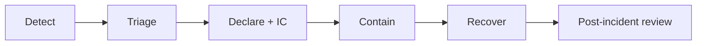

# Overview

## Purpose

Provide a **single, versioned** source for how `YOUR_ORG` responds when systems fail, security is threatened, or data integrity is at risk. This is not legal advice; involve **legal** and **privacy** early when personal or regulated data may be affected.

## Scope

- **In scope:** Production and customer-impacting services listed in `YOUR_SERVICE_CATALOG_LINK`
- **Out of scope:** Physical safety (use `YOUR_EHS_PROCESS`), workplace violence (use `YOUR_SECURITY_PROCESS`)

## Severity (example — align with your org)

| Level | Meaning | Example triggers |
|-------|---------|------------------|
| **SEV-1** | Major customer impact or existential risk | Full region down, active exploitation, mass data exposure |
| **SEV-2** | Significant subset of users / functions | Single service hard-down, suspected breach unconfirmed |
| **SEV-3** | Limited impact or internal-only | Degraded performance, non-prod spill |

Declare and record severity in the **incident ticket**; IC may re-grade as facts change.

## Incident lifecycle (high level)

## Evidence and record-keeping

- One **primary incident ticket** with timeline, decisions, and links to logs.
- Preserve **immutable** copies of critical logs when breach or legal hold is possible (coordinate with security/legal).
- Do **not** delete chat or ticket history; add corrections as new comments.

## Review cadence

- **Quarterly:** IC and security review this repo; open PRs for changes.
- **After every SEV-1 / breach-class event:** Mandatory playbook updates within `YOUR_SLA_DAYS` days.
