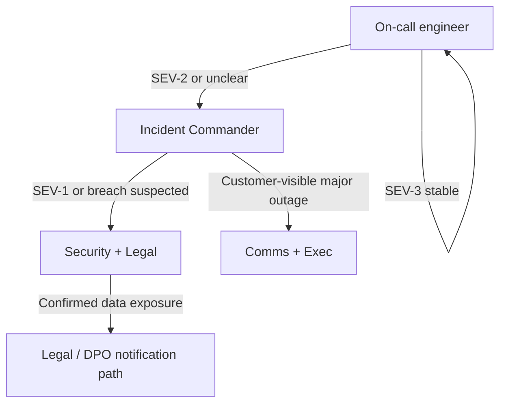

# Roles and escalation

Fill in names, phone numbers, and backups in your internal directory or secure wiki; keep **this repo free of PII**.

## Core roles

| Role | Responsibility |
|------|----------------|
| **Incident Commander (IC)** | Single authority for scope, priority, and external comms approval |
| **Technical lead** | Drives mitigation, coordinates engineers |
| **Comms lead** | Internal + customer messaging per approved templates |
| **Security lead** | Breach assessment, forensics coordination, regulator/customer security notices |
| **Legal / Privacy** | Regulatory obligations, contracts, breach notification |
| **Executive sponsor** | Escalation for SEV-1, brand, or legal exposure |

## Escalation ladder (example)

## Handoff

- IC handoff: **verbal + ticket** with current state, open decisions, and next update time.
- After resolution: IC remains owner until **post-incident review** is scheduled.
