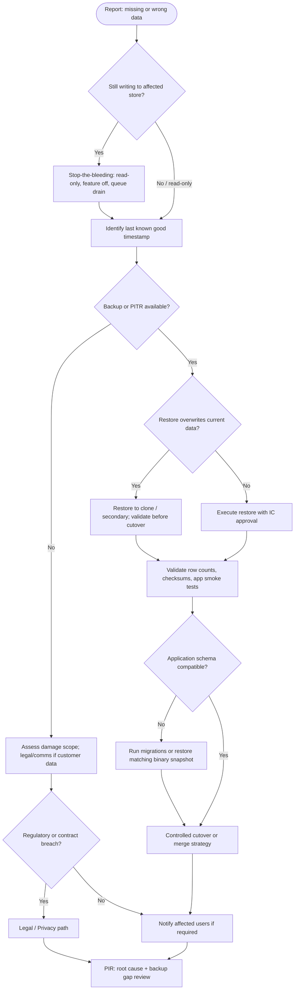

# Scenario: Data loss or corruption

Use for **accidental deletion**, **bad migration**, **replication failure**, **ransomware**, or **integrity errors** (wrong data shown to users). Pair with **backup / DR** procedures.

## Decision tree

## Immediate actions (checklist)

- [ ] **Time-bound** the event: when did data last look correct?
- [ ] **Scope:** which tenants, tables, buckets, regions
- [ ] **Freeze** destructive jobs (migrations, GC, retention policies) until IC approves
- [ ] Locate **backup ID** or **PITR** point; test restore in **non-prod** slice if possible
- [ ] Document **RPO** actually achieved vs target

## Restore strategies

| Situation | Typical approach |
|-----------|------------------|
| Bad deploy wrote bad rows | Roll forward fix vs restore subset |
| Dropped table / bucket | PITR or backup restore to staging then merge |
| Replica lag / split-brain | Stop writes, elect source of truth, resync |

## Comms

- If users saw **wrong** data: coordinate **Comms + Legal** (may be breach-class).
- If **loss** only (data gone): message per policy; avoid technical blame in external text.

## Exit criteria

- Data **validated** against business checks; monitoring green.
- **Backup/restore test gap** filed if restore was untested or failed first attempt.

## Links

- Backup and DR runbook: `YOUR_BACKUP_DR_LINK`
- Database ownership: `YOUR_DBA_CONTACT`
