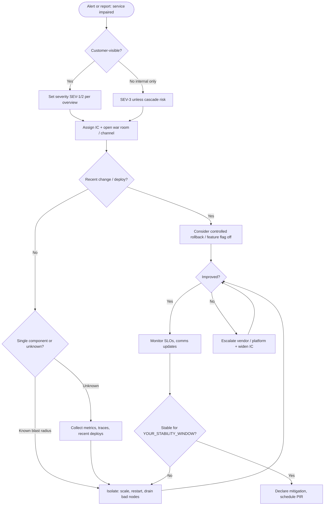

# Scenario: Service outage

Use when customers or internal users **cannot use a production service** (errors, timeouts, total unavailability). Not for security-only events (use [security-breach.md](security-breach.md)).

## Decision tree

## Immediate actions (checklist)

- [ ] Create **incident ticket**; pin command channel
- [ ] IC assigned; **severity** recorded
- [ ] **Customer impact** statement (factual, one paragraph)
- [ ] **Comms** next-update time set
- [ ] Identify **change correlation** (deploy, config, DNS, third party)
- [ ] **Mitigate** before root-cause if needed (rollback, scale, bypass)

## Useful splits (parallel workstreams)

| Stream | Tasks |
|--------|--------|
| **App** | Errors, saturation, recent releases |
| **Data** | DB connectivity, replication lag, locks |
| **Network / edge** | DNS, CDN, WAF, TLS |
| **Dependencies** | APIs, queues, payment providers |

## Exit criteria

- Service meets **SLO / error budget** for agreed window, or documented degraded mode with customer comms.
- IC hands off to owner for **PIR** within `YOUR_PIR_SLA`.

## Links

- DR / failover: `YOUR_DR_RUNBOOK_LINK`
- Status page: `YOUR_STATUS_PAGE`
