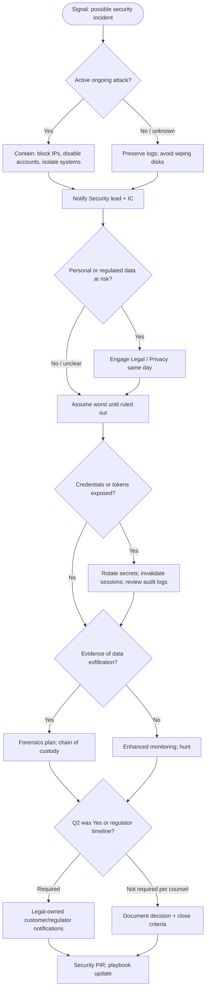

# Scenario: Security breach or suspected compromise

Use for **unauthorized access**, **credential leak**, **malware on prod systems**, **suspicious admin activity**, or **report of data exposure**. **Preserve evidence**; avoid destructive actions until Security advises.

## Decision tree

## Immediate actions (checklist)

- [ ] **Do not** announce details publicly until Comms + Legal align
- [ ] IC + **Security lead** engaged; incident **classified** (suspected / confirmed)
- [ ] **Audit logs** from identity, cloud, app, CDN — export to secure storage if advised
- [ ] **Scope:** which systems, data classes, time window
- [ ] **Containment** that does not destroy evidence (snapshot volumes per policy, not ad-hoc deletes)
- [ ] **Legal / Privacy** if PHI, financial, children’s data, or contract triggers apply

## Coordination

| If… | Then… |
|-----|--------|
| Ransom demand received | **Legal + law enforcement path** per policy; do not pay without exec/legal |
| Customer reports abuse of their data | Validate claim; **support + security** joint ticket |
| Supply chain / dependency compromise | Map blast radius; pin versions; notify downstream |

## Exit criteria

- Security and Legal agree **containment** and **notification** obligations are addressed (or formally documented as N/A with rationale).
- **PIR** completed with remediation items tracked.

## Links

- Vendor security contacts: `YOUR_VENDOR_LIST`
- Data classification: `YOUR_DATA_POLICY_LINK`
